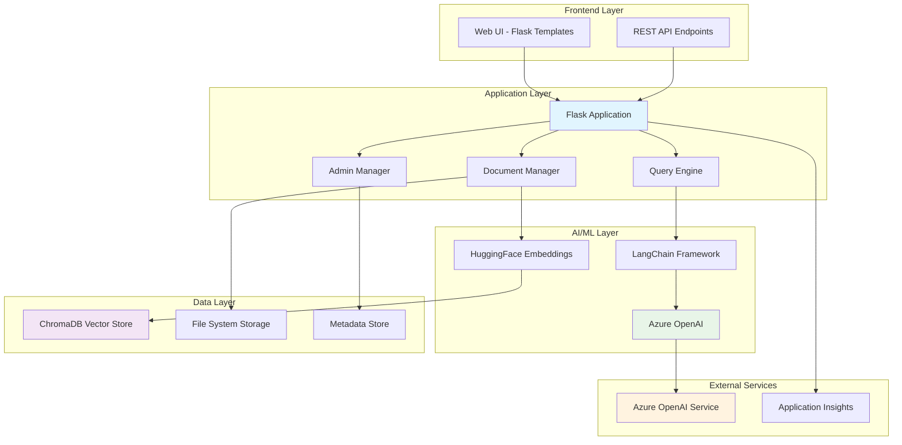

# Resume RAG AI System 🚀

## Overview

The **Resume RAG AI System** is an intelligent document management and query platform that combines **Retrieval-Augmented Generation (RAG)** with **Azure OpenAI** to provide powerful resume search and analysis capabilities. Built with Flask and ChromaDB, it enables organizations to efficiently store, search, and analyze resume collections using natural language queries.

## What It Does

### 🎯 **Core Capabilities**
- **Document Ingestion**: Upload and process PDF/DOCX resume files
- **Intelligent Search**: Natural language queries across resume collections  
- **AI-Powered Analysis**: Generate insights and summaries using Azure OpenAI
- **Collection Management**: Organize resumes into logical collections
- **Real-time Queries**: Interactive chat interface for resume exploration
- **Cost Tracking**: Monitor Azure OpenAI usage and costs

### 🔍 **Use Cases**
- **HR Teams**: Quickly find candidates matching specific criteria
- **Recruiters**: Analyze resume databases with natural language
- **Talent Acquisition**: Compare candidate profiles and skills
- **Portfolio Management**: Organize and search personal resume collections

## High-Level Architecture



## Data Flow Architecture

### 📄 **Document Ingestion Flow**
```
1. User uploads PDF/DOCX files
2. Document Manager extracts text content
3. HuggingFace creates vector embeddings
4. ChromaDB stores vectors + metadata
5. Collection updated with new documents
```

### 🔍 **Query Processing Flow**
```
1. User submits natural language query
2. Query Engine creates query embeddings
3. ChromaDB performs vector similarity search
4. Relevant documents retrieved as context
5. LangChain formats prompt for Azure OpenAI
6. AI generates contextual response
7. Results displayed with cost tracking
```

### 📊 **Data Storage Strategy**
```
ChromaDB Collections
├── Document Vectors (embeddings)
├── Document Metadata (filename, date)
├── Collection Information
└── Search Indices

File System
├── Original Documents (/data)
├── Vector Database (/resume_vectordb)
└── Application Logs
```

## User Interaction Flow

### 🏠 **Main Dashboard**
- **Collection Overview**: View all document collections
- **Statistics**: Document counts, storage usage
- **Quick Actions**: Create collections, upload documents
- **System Status**: Health checks, configuration

### 📁 **Collection Management**
```
Admin → Collections → [Create/Edit/Delete]
                   → [View Documents]
                   → [Upload Files]
                   → [Bulk Operations]
```

### 🔍 **Query Interface**
```
User Query → [Natural Language Input]
          → [Collection Selection]
          → [Advanced Filters]
          → [Execute Search]
          → [Results + AI Analysis]
          → [Cost Summary]
```

### 📋 **Administrative Workflows**
```
Database Manager → [View Collections]
                → [Backup/Restore]
                → [Performance Metrics]
                → [Storage Management]

Debug Tools → [Collection Inspector]
           → [Query Debugging]
           → [Vector Analysis]
           → [Error Diagnostics]
```

## Technology Stack

### 🖥️ **Backend Framework**
- **Flask**: Web application framework
- **Gunicorn**: WSGI production server
- **Python 3.11**: Core runtime environment

### 🤖 **AI/ML Components**
- **Azure OpenAI**: GPT-4 for text generation
- **LangChain**: RAG framework and orchestration
- **HuggingFace**: Sentence transformers for embeddings
- **ChromaDB**: Vector database for similarity search

### 🎨 **Frontend Technologies**
- **Jinja2 Templates**: Server-side rendering
- **Bootstrap 5**: Responsive UI framework
- **JavaScript**: Interactive client features
- **HTML/CSS**: Custom styling and layout

### ☁️ **Cloud & DevOps**
- **Docker**: Containerization
- **Azure App Service**: Cloud hosting
- **Azure Container Registry**: Image storage
- **Application Insights**: Monitoring and logging

## Key Features

### 🔐 **Security & Configuration**
- Environment-based configuration
- Secure API key management
- HTTPS enforcement in production
- Container security best practices

### 📈 **Performance & Scalability**
- Asynchronous document processing
- Efficient vector similarity search
- Optimized embedding generation
- Production-ready container setup

### 🛠️ **Developer Experience**
- Comprehensive error handling
- Detailed logging and debugging
- Local development environment
- Automated deployment scripts

### 💰 **Cost Management**
- Real-time Azure OpenAI usage tracking
- Token count monitoring
- Cost estimation per query
- Resource usage analytics

## Getting Started

### 🚀 **Quick Start**
1. **Clone the repository**
2. **Configure environment variables** (Azure OpenAI credentials)
3. **Run with Docker Compose**: `docker-compose up --build`
4. **Access the application**: `http://localhost:5001`

### 📚 **Documentation**
- [`DEPLOYMENT.md`](DEPLOYMENT.md) - Production deployment guide
- [`LOCAL_TESTING_GUIDE.md`](LOCAL_TESTING_GUIDE.md) - Local development setup
- [`CONTAINER_BUILD_GUIDE.md`](CONTAINER_BUILD_GUIDE.md) - Docker containerization
- [`QUICK_START.md`](QUICK_START.md) - Azure deployment reference

## Project Structure

```
resume-rag-ai/
├── common_tools/openwebui-resume-rag-admin/
│   ├── src/                    # Flask application code
│   ├── templates/              # HTML templates
│   ├── static/                 # CSS/JS assets
│   └── config/                 # Configuration files
├── data/                       # Document storage
├── resume_vectordb/            # ChromaDB database
├── infra/                      # Azure infrastructure (Bicep)
├── Docker files & deployment scripts
└── Documentation & guides
```

## Contributing

This system is designed for enterprise resume management and AI-powered candidate search. It combines the power of vector databases, language models, and modern web technologies to create an intelligent document management platform.

---

**Built with ❤️ using Flask, ChromaDB, LangChain, and Azure OpenAI**